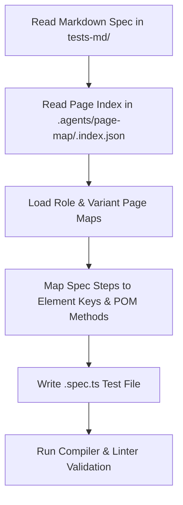

# Browser-Free Test Authoring Skill

This skill governs the authoring of Playwright `.spec.ts` tests from markdown specifications (`tests-md/`) using committed, versioned **Page Maps** (`.agents/page-map/`) and Page Object Model (POM) classes.

> [!CAUTION]
> **test-author must NOT launch a browser during test authoring.**
> Element discovery is performed entirely offline by consulting the committed Page Maps in `.agents/page-map/`.
> Do not execute interactive browser exploration, Playwright CLI/MCP snapshots, or dynamic page inspection.

---

## 📝 5-Step Authoring Workflow



### Step 1: Read the Markdown Test Specification

Locate and read the specification file in `tests-md/` (e.g. `tests-md/RESERVE_010.md`). Note:

- Preconditions (e.g. user authentication role, initial URL).
- Test steps (actions to perform, inputs to enter).
- Expected results & verification assertions.

### Step 2: Read the Page Map Index

Read `.agents/page-map/<PageKey>.index.json` for each page involved in the scenario (e.g. `HotelHome.index.json`, `HotelReservation.index.json`, `HotelLogin.index.json`).

- Review `roles` and `variants`.
- Check `commonElementKeys` and `variantSpecificElementKeys`.

### Step 3: Load the Required Page Map Files

Read the specific `<PageKey>.<roleKey>.<variantKey>.json` file(s) needed for your test flow:

- Inspect element `key`, `role`, `accessibleName`, and `locator`.
- Inspect `requiresScoping` and `scope` for repeated lists or table items.

### Step 4: Map Spec Steps to POM Locators & Methods

- Match actions from the spec to the POM classes in `src/pages/<area>/` and generated POMs in `src/pages/<area>/generated/`.
- Use the stable, typed element keys (e.g. `breakfastCheckbox`, `stayRequiredSpinbutton`, `submitButton`).

> [!WARNING]
> **Missing Element Rule**: If an element required by the spec is not present in the page map, **STOP and FAIL immediately** with the message:
>
> ```text
> Element '<element_name>' not found in page map for <PageKey>.<roleKey>.<variantKey>.
> Please re-run the harvester or update targets in .agents/harvester/targets.ts.
> ```
>
> **Never fall back to launching a browser or performing manual DOM exploration.**

### Step 5: Write the `.spec.ts` Test File

Create or update the test file in `src/tests/ui/<area>/<testName>.spec.ts`:

- Import fixtures from `fixtures/base-fixture`.
- Use `@step` decorated methods or typed POM locators.
- Use web-first assertions (`expect(locator).toBeVisible()`, `expect(locator).toHaveText()`).

---

## 🔍 Validation Workflow

After writing the `.spec.ts` file, validate the implementation:

1. **Verify TypeScript & Linting**:

   ```bash
   npm run tsc && npm run lint:check && npm run format:check
   ```

2. **Execute Test Suite Locally**:

   ```bash
   # For hotel tests:
   npm run test:ui-hotel

   # For TestArchitect tests:
   npm run test:ui-ta
   ```

3. **Format Code**:
   ```bash
   npm run format
   ```
